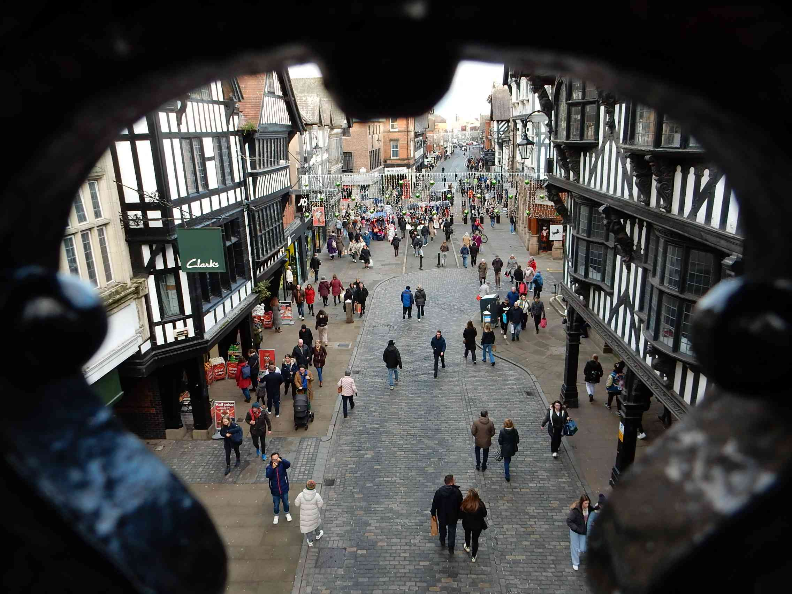
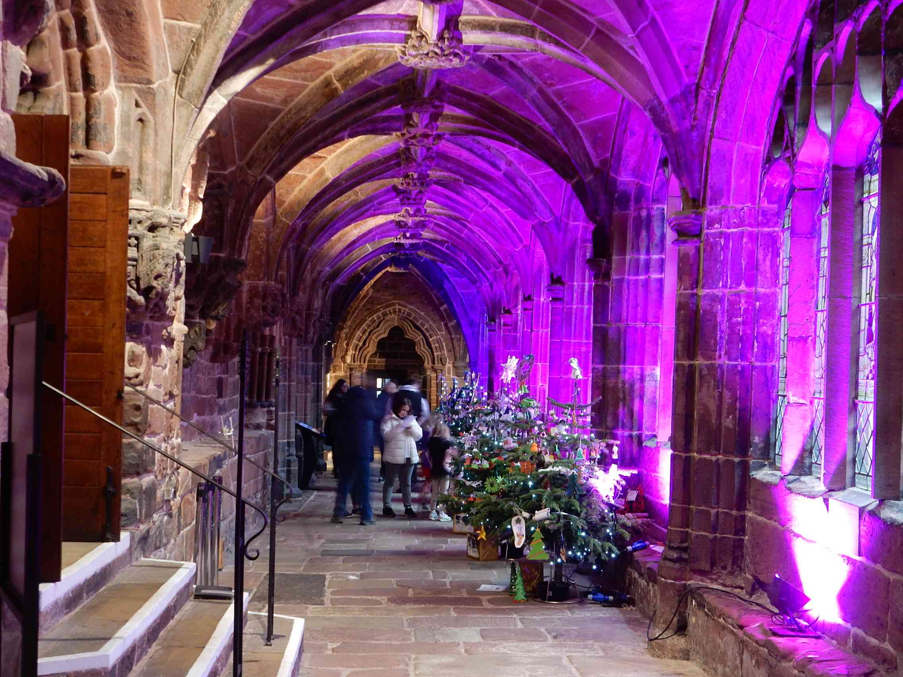
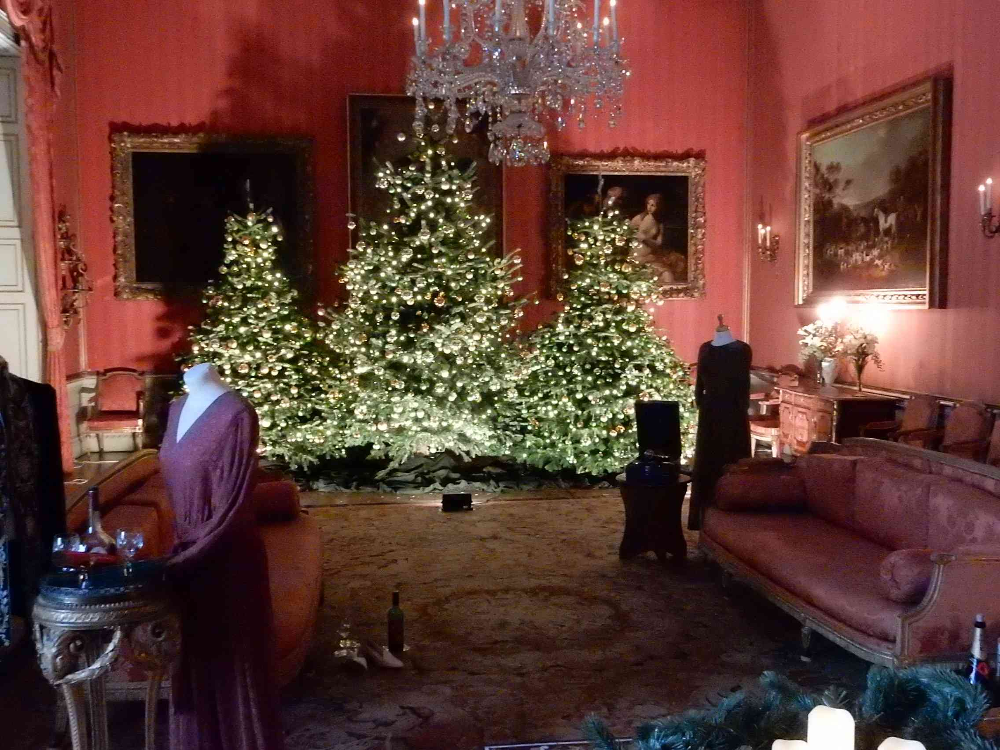

SectionStartDate-2024-11-29_Chester

## Chester
### 2024-11-29 Day 1
Busy morning sorting Christmas orders on Amazon. We left just after 9am. Very busy on the motorway, we went out usual route to Leigh even stopping at the usual service station. Our first route option was changed because of traffic problems so we came off at junction 18. Arrived at the park and ride. Adele had just got ready and the bus arrived, £2.50 day ticket. Stopping at the main bus station - very fancy.
We walked all the way round the walls, with lots of information boards to read. It was chilly but dry at first. Lots of pretty buildings.

Amphitheatre - only a small section was visible. It's a very scenic walk. We ended up at the WeatherSpoons pub - The Broken Bottle. Very full but not too busy. Even though it was too early we had fish and chips - midweek specials for under £9 including a drink.
It was dark when we left, walked a little way up the road and our bus turned up - PR2. The hostel is a fair way out, very grand house. We had a room in the external bit, warm and quiet.

## Chester
### 2024-11-30 Day 2
Last night was very warm in bed, but we slept ok. Our room looks out into a bit of woodland with blackbirds and squirrels - very pretty. Not too busy in the kitchen for breakfast. No flask today, as there's lots of cafes. We drove to the same park and ride again - much easier than walking the 500m to the bus stop. The day was much warmer and a bit of sun. We asked in the cathedral about pre booking our visit in the afternoon, but was told to just turn up. We went over to the amphitheatre then down to the river, very pretty.

A few more notable buildings then over to the Weatherspoons again. We intended to have their breakfast but the rumour was that the chef refused to do any more cooking because of complaints. So we had to leave and march over to the other Weatherspoons. Also very busy but found a table and we had a very nice large breakfast / lunch. Very noisy.
We went around the shops and visited the cathedral - tree displays.

The Christmas market was also busy but full of stuff. The whole centre is full of people in bars and restaurants. We went into a few outdoor shops looking for my trousers - no joy. We walked along the rows - the second floor of shops. All very scenic.
We got the bus back to the carpark and drove to the hostel in the dark again. Busy in the hostel but we managed to cook our potatoes and pre-cooked chilli sauce in the microwave - no hobs. Another card game Ah-Ahhr a memory game - a bit of fun. Yesterday was Maponimoes, a bit more complicated, matching European countries. A group of S Koreans chatted to us, such a long way to come. In spite of the fact that the hostel was busy it was so big that we didn't see many people around.

## Chester
### 2024-12-01 Day 3
First day of December - Christmas is getting closer!  It had been raining overnight but the sun still came out. The raindrops on the trees looked like jewels. Adele picked some huge apples from a nearby tree, from the ground. It was very empty until 9am then people started to appear. As we were leaving we passed 2 cars with AA repair men at the front of the hostel, then a car crash where the drive met the main road, with 3 police cars! We went into Chester looking for the free racecourse parking - a well kept secret. From there we could walk into the centre. We walked along the river to Grosvenor park, where we saw Santa on the mini train. Lots of people in Santa outfits - Santa run. There was a bunch of the costumes dumped in a bin which we couldn't resist. We tried the Red Lion pub for lunch - not a Wetherspoon. Not as busy we were one of the few people having food. Everywhere was not as busy as yesterday. Then the Grosvenor Museum, lots of interesting bits - we really had done Chester. Back to the hostel in the daylight. Very few people staying.

## Chester
### 2024-12-02 Day 4
As a special treat on our last morning we had a hostel meal. As it was pretty empty he cooked it when we arrived - nice and hot. So we stuffed ourselves again. A wet morning but it got drier through the day. We headed for Shugborough Hall - NT place, near Stafford.

It was very cloudy but the rain held off. Lots to see and read in the house, more Christmas trees. Finished off with coffee, then home.
